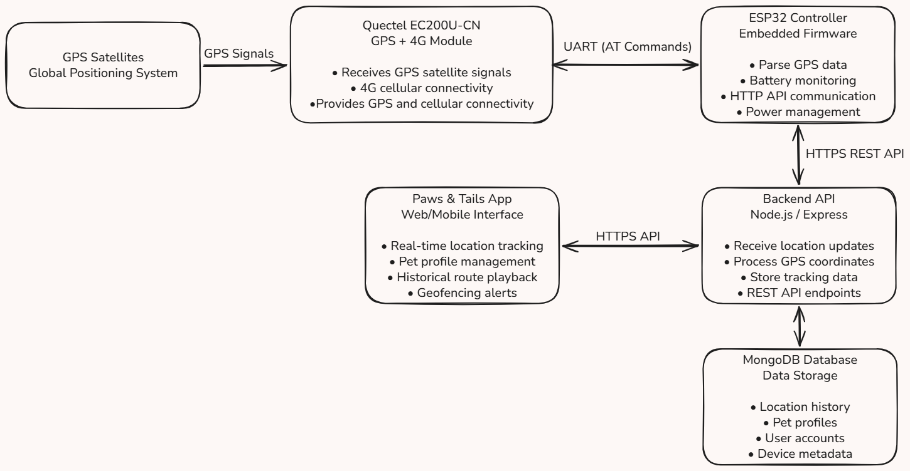

# 🐾 Paws & Tails - Pet Collar Tracker (Firmware)

> ESP32-S3 + Quectel EC200U-CN embedded firmware for real-time GPS pet tracking via 4G LTE.

---

## Overview

This is the embedded firmware component of the **Paws & Tails** pet tracking platform. It runs on an ESP32 microcontroller paired with a Quectel EC200U-CN GPS + 4G LTE module. The collar communicates with the Paws & Tails backend over HTTPS, enabling real-time location tracking, geofencing alerts, and historical route playback via the web/mobile app.



---

## Hardware

| Component | Details |
|---|---|
| Microcontroller | ESP32-S3 |
| GPS + Cellular Module | Quectel EC200U-CN (GPS + 4G LTE) |
| UART RX Pin | GPIO 12 |
| UART TX Pin | GPIO 13 |
| Baud Rate | 115200 |

---

## Project Structure

```
PET-COLLAR-TRACKER/
├── docs/
│   └── system_architecture.png  # System architecture diagram
├── firmware/
│   ├── modem_handler.cpp        # UART init + AT command driver
│   ├── modem_handler.h          # Modem API declarations
│   └── pet_collar_tracker.ino   # Main Arduino sketch - setup & loop
└── README.md
```

---

## Firmware Architecture

### `pet_collar_tracker.ino`
The main sketch. On boot (`setup()`), it:
1. Initialises Serial for debug output
2. Calls `modemInit()` to bring up the UART link to the EC200U
3. Runs the AT command startup sequence (see below)
4. Queries the first GPS fix

The `loop()` is the place to add periodic location polling and HTTPS upload logic.

### `modem_handler.cpp / .h`
Thin driver layer for the EC200U over `HardwareSerial` (UART1).

- **`modemInit()`** — Opens UART1 at 115200 baud on GPIO 12/13 and waits 3 s for the module to boot.
- **`sendATCommand(command, timeout_ms)`** — Flushes the RX buffer, sends a command, reads the response, and returns `true` on `OK` or `false` on `ERROR`/timeout. All traffic is mirrored to Serial for debugging.

---

## AT Command Startup Sequence

| Command | Purpose |
|---|---|
| `ATE0` | Disable echo |
| `AT` | Modem alive check |
| `AT+CPIN?` | SIM card status |
| `AT+CSQ` | Signal quality (RSSI) |
| `AT+CREG?` | Network registration status |
| `AT+QGPS=1` | Enable GNSS engine |
| `AT+QGPSLOC?` | Get first GPS fix |

---

## Getting Started

### Prerequisites

- [Arduino IDE](https://www.arduino.cc/en/software) ≥ 2.x **or** [PlatformIO](https://platformio.org/)
- ESP32 board package installed (`esp32` by Espressif)
- Active SIM card with data plan inserted in the EC200U

### Setup

1. Clone this repo:
   ```bash
   git clone https://github.com/<your-username>/paws-and-tails-collar.git
   cd paws-and-tails-collar
   ```

2. Open `pet_collar_tracker.ino` in Arduino IDE.

3. Select your board: **Tools → Board → ESP32S3 Dev Module** (or whichever variant you're using).

4. Select the correct COM/USB port.

5. Upload the sketch.

### Serial Monitor

Open the Serial Monitor at **1152000 baud** to watch the full startup sequence and AT command responses in real time.

> ⚠️ **Note:** The sketch currently uses `Serial.begin(1152000)`. If you see garbled output, check this matches your monitor setting. Consider `115200` for standard debugging.

---

## Roadmap

- [ ] Periodic GPS polling in `loop()` (configurable interval)
- [ ] HTTPS POST to Paws & Tails backend (`AT+QHTTPPOST`)
- [ ] Battery voltage ADC monitoring and low-battery alerts
- [ ] Deep sleep / power management between transmissions
- [ ] Geofence breach detection on-device
- [ ] OTA firmware update support

---

## Related Repositories

| Repo | Description |
|---|---|
| [`paws-and-tails-backend`](https://github.com/<your-username>/paws-and-tails-backend) | Node.js / Express API — receives location updates, serves the app |
| [`paws-and-tails-app`](https://github.com/<your-username>/paws-and-tails-app) | React/Vite frontend — live map, pet profiles, geofencing |

---

## License

MIT © Vinay - built for Shadow 🐕